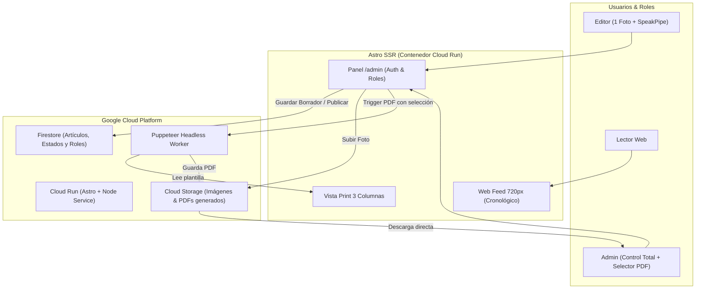

# Plan Maestro: CMS Fanzine Guerrilla "La Parte Arrendataria"
*(Neobrutalismo Digital × Prensa de Guerrilla Vintage)*

Un Content Management System basado en **Astro**, diseñado con una estética híbrida entre **neobrutalismo digital** (bordes negros duros, sombras sólidas, alto contraste) y **prensa/fanzine fotocopiable** (tramas de medios tonos/halftones, texturas de papel periódico, tipografías serif editoriales y monoespaciadas, maquetación modular), optimizado para desplegarse en **Google Cloud Platform** con generación de **PDF editorial a 3 columnas** para distribución física.

---

## 1. Identidad Editorial y Cabecera de Publicación

Tanto la versión impresa como la digital comparten la misma identidad tipográfica de cabecera histórica de periódico / fanzine:

```
                  LA PARTE
         ┌─────────────────────────┐
         │     ARRENDATARIA        │
         └─────────────────────────┘
```
- **Arriba**: Subtítulo centrado en menor tamaño: `"La Parte"`.
- **Principal (H1)**: Titular de impacto en gran escala: `"Arrendataria"`.
- **Comportamiento según canal**:
  - **En el PDF (Portada/Cabecera)**: Ocupa el **ancho total de la página** (full-bleed o ancho caja imprimible), seguido inmediatamente de un filete tipográfico doble/punteado y el inicio de los artículos seleccionados a 3 columnas.
  - **En la Web pública**: La cabecera y el cuerpo del feed se enmarcan en un contenedor centralizado de **720px de ancho máximo**, seguido del listado cronológico de artículos (del más reciente al más antiguo).

---

## 2. Sistema de Roles y Permisos (RBAC)

El CMS define dos roles con responsabilidades y accesos claramente acotados:

| Rol | Permisos y Capacidades | Vistas Permitidas |
| :--- | :--- | :--- |
| **Editor** | - Crear y editar sus propios artículos en borrador.<br>- Subir **1 única foto** por artículo.<br>- Grabar audio (máx. 2 min) vía **SpeakPipe API**.<br>- Redactar contenido en Markdown y definir enlace a fuente original.<br>- *No puede publicar ni borrar artículos ni generar PDFs.* | `/admin/drafts`<br>`/admin/new-article` |
| **Admin** | - Todas las capacidades de un CMS completo.<br>- **Revisar, editar, publicar y eliminar** cualquier artículo.<br>- **Selección de artículos** para confeccionar una edición del fanzine.<br>- **Exportar a PDF** a 3 columnas con un solo clic.<br>- Gestión de usuarios/roles y configuración general. | `/admin` (completo)<br>`/admin/articles`<br>`/admin/export-fanzine`<br>`/admin/settings` |

---

## 3. Especificación de Contenido del Artículo

Cada artículo funciona como una pieza editorial multimedia en la web y como un bloque modular en el fanzine físico:

1. **Fotografía Única (1 Foto Máximo)**:
   - Restricción estricta de 1 imagen por artículo para mantener la disciplina editorial.
   - *Web*: Encuadre neobrutalista (borde 3px negro, pie de foto monoespaciado).
   - *PDF*: Procesamiento con filtro halftone / dither en blanco y negro para optimizar la reproducción en fotocopiadora.
2. **Audio Voice-Note de 2 Minutos (SpeakPipe API)**:
   - Integración del grabador de [SpeakPipe](https://www.speakpipe.com/).
   - *Web*: Reproductor brutalista para escucha inmediata.
3. **Cuerpo en Markdown**:
   - Soporte para subtítulos, listas, citas (*pull-quotes*) y negritas.
   - *PDF*: Letras capitulares (*drop caps*), corte de palabras silábico (*hyphenation*) y flujo a 3 columnas.
4. **Enlace a Fuente Original + QR Autogenerado (Exclusivo en PDF)**:
   - Campo para URL de referencia.
   - *Web*: Enlace al final del artículo.
   - *PDF*: Se renderiza **exclusivamente en el PDF** un código QR vectorial autogenerado (`qrcode`) con un marco de sello de imprenta (*"ESCANEA PARA LEER FUENTE ORIGINAL"*).

---

## 4. Módulo de Exportación a PDF (Fanzine a 3 Columnas)

### 4.1 Flujo del Administrador
1. El Administrador accede a `/admin/export-fanzine`.
2. Visualiza el catálogo de artículos publicados y **marca mediante checkboxes** los artículos que compondrán este número/edición del fanzine.
3. Puede ordenar la prioridad de aparición de los artículos en las columnas.
4. Pulsa **"Exportar Fanzine (PDF)"**.

### 4.2 Maquetación Print CSS y Renderizado
- Se compila una vista oculta de impresión (`/print/issue-preview`).
- **Cabecera**: "La Parte" centrado arriba y "Arrendataria" como H1 a todo el ancho.
- **Cuerpo**: Layout multi-columna continuo (`column-count: 3; column-gap: 1.25rem; column-rule: 1px solid #111;`).
- Puppeteer en Cloud Run ejecuta el renderizado a PDF respetando las directivas `@page` (márgenes de imprenta, marcas de corte opcionales y numeración de página).

---

## 5. Arquitectura Técnica en Google Cloud



### 5.1 Servicios de Google Cloud
- **Google Cloud Run**: Servicio sin servidor (Serverless container). Ejecuta la aplicación Astro en modo Node SSR y Puppeteer con dependencias de Chromium. Escala a cero para coste mínimo.
- **Google Cloud Firestore**: Base de datos documental flexible y rápida para los artículos, usuarios y selecciones de números del fanzine.
- **Google Cloud Storage (GCS)**: Bucket público/firmado para almacenar las imágenes de artículos y los PDFs finales generados.
- **Firebase Authentication**: Autenticación segura lista para gestionar correos y asignar Custom Claims de roles (`admin` vs `editor`).

---

## 6. Fases de Ejecución

1. **Fase 1: Configuración Base & Estructura Astro**
   - Inicialización del proyecto Astro con `@astrojs/node` y Tailwind CSS.
   - Creación del sistema de diseño (tipografías vintage, paleta de blanco roto y negro tinta, bordes brutalistas, cabecera "La Parte Arrendataria" de 720px para web).
2. **Fase 2: Backend, Auth y Modelo de Datos (Firestore)**
   - Configuración de Firebase Auth con control de acceso por roles (`admin` y `editor`).
   - Colección `articles` en Firestore con esquemas para autor, markdown, url de foto, audio speakpipe y fuente original.
3. **Fase 3: Panel de Administración (/admin)**
   - Formulario simplificado para el **Editor** (1 imagen, SpeakPipe, Markdown, Fuente).
   - Panel de control de **Admin** (Aprobación, borrado, gestión completa y selector de artículos para el fanzine).
4. **Fase 4: Motor de PDF Fanzine (3 Columnas + QR)**
   - Maquetación CSS de la vista de impresión con cabecera a todo ancho y 3 columnas.
   - Integración de generación de QR para fuentes originales.
   - Endpoint de Puppeteer para renderizado y descarga directa de PDF.
5. **Fase 5: Despliegue en Google Cloud Run**
   - Creación de `Dockerfile` multistage optimizado con Chromium.
   - Configuración del proyecto GCP, buckets de Cloud Storage e integración continua.
